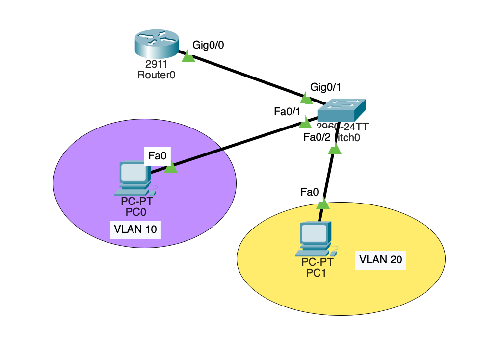

# cisco-intervlan-lab
# Inter-VLAN Routing (Router-on-a-Stick) Lab

## 📌 Project Overview
This lab demonstrates the implementation of **Router-on-a-Stick (ROAS)** architecture using Cisco IOS. It enables communication between two isolated VLANs (HR & IT) across a single physical trunk link using 802.1Q encapsulation.

---

## 🖼️ Network Topology


---

## 📊 IP Addressing Table

| Device | Interface | IP Address | Subnet Mask | Default Gateway | Purpose |
|---|---|---|---|---|---|
| **Router0** | G0/0.10 | 192.168.10.1 | 255.255.255.0 | N/A | VLAN 10 Gateway |
| **Router0** | G0/0.20 | 192.168.20.1 | 255.255.255.0 | N/A | VLAN 20 Gateway |
| **PC-HR** | FastEth0 | 192.168.10.10 | 255.255.255.0 | 192.168.10.1 | HR Host |
| **PC-IT** | FastEth0 | 192.168.20.10 | 255.255.255.0 | 192.168.20.1 | IT Host |

---

## ⚙️ Configuration Snippets

### 1. Cisco Switch (2960) Configuration
```cisco
! Create VLANs
enable
configure terminal
vlan 10
 name HR_Dept
vlan 20
 name IT_Dept
exit

! Assign Access Ports to VLANs
interface FastEthernet0/1
 switchport mode access
 switchport access vlan 10
 no shutdown

interface FastEthernet0/2
 switchport mode access
 switchport access vlan 20
 no shutdown

! Configure 802.1Q Trunk Port to Router
interface GigabitEthernet0/1
 switchport mode trunk
 no shutdown
exit
